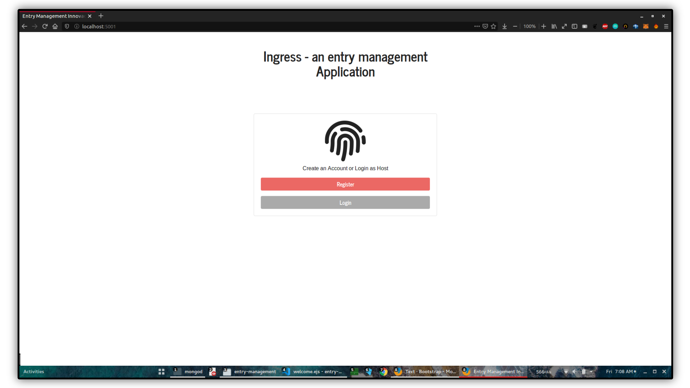
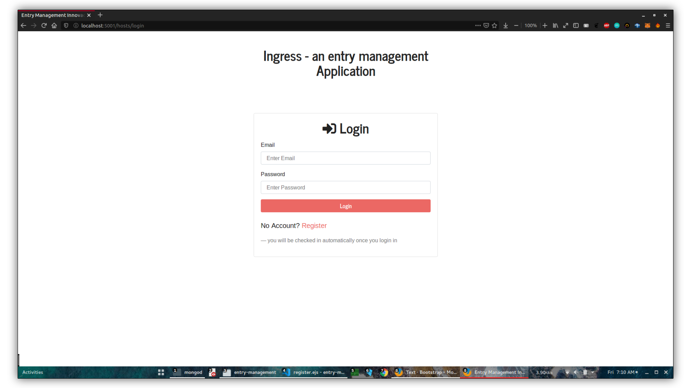
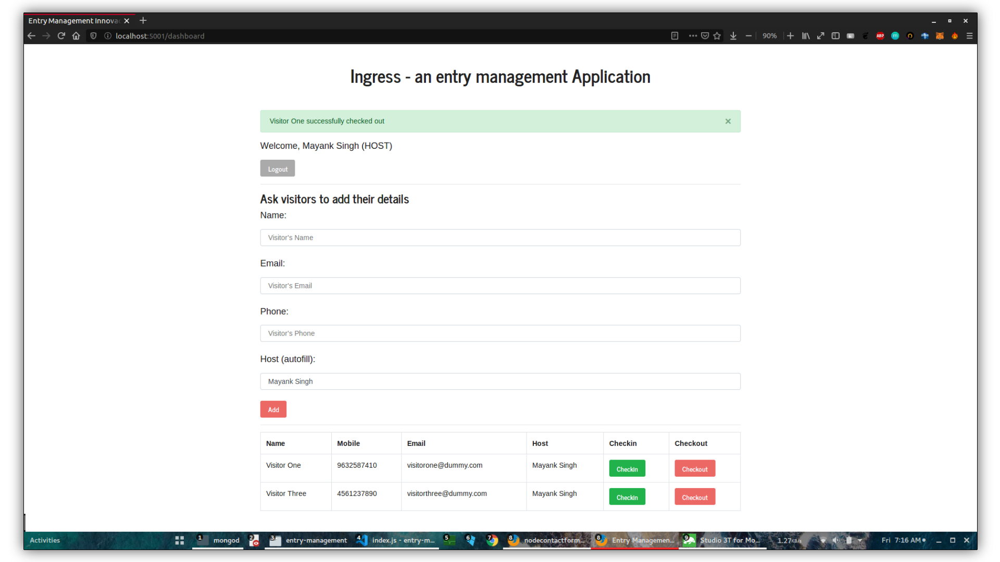

<div align="center">
<p>
  
</p>

<p>

</p>

[](https://github.com/code-monk08/entry-management/issues) [](https://github.com/code-monk08/entry-management/network/members) [](https://github.com/code-monk08/entry-management/stargazers)        [](https://telegram.me/codemonk08)

</div>

## Index

- [Index](#index)
- [About](#about)
- [Usage](#usage)
  - [Installation](#installation)
- [File Structure](#file-structure)
- [Guideline](#guideline)
- [Gallery](#gallery)
- [Credit/Acknowledgment](#creditacknowledgment)
- [License](#license)
- [Logo Credit](#logo-credit)

## About

This is Ingress an easy to use MVP on entry management, Ingress was built using Node.js and MongoDB database, It uses [ejs](https://ejs.co/) (embedded javascript templates), it also supports sending **EMAILS** and **SMS** using nodemailer module and Nexmo API respectively, this project was implemented as my submission for the innovacer [summergeeks](https://summergeeks.in/) internship challenge by [Innovacer](https://innovaccer.com/), It meets all the criterias as mentioned in the assignment provided by summergeeks.

## Usage

### Installation

**Development**

If you just want to do a simple test run of the application, you can  first

- Clone the repository

```bash
$ git clone https://github.com/code-monk08/entry-management.git
```
- Install dependencies by using the following commands.

```bash
$ cd entry-management
$ sudo npm install
```
- Obtain API Key & API Secret from [Nexmo SMS](https://www.nexmo.com/) API

- create a `.env` file in root directory and assign the following environment variables
`NOTE: don't version control your .env file, make sure .env is added in .gitignore file`
```bash
$ cd entry-management
$ touch .env
$ echo "PORT={5001 or port of your choice}" >> .env
$ echo "SECRET={some secret message of your choice}" >> .env
$ echo "EMAIL={your email id}" >> .env
$ echo "PASSWORD={your email password}" >> .env
$ echo "NEXMOAPIKEY={your nexmo api key for sms}" >> .env
$ echo "NEXMOAPISECRET={your nexmo api secret for sms}" >> .env
```

- Finally run the application using 

```bash
$ mongod
$ node app.js
```  

## File Structure
- Add a file structure here with the basic details about files, below is an example.

```bash
.
├── app.js
├── node_modules
├── config
│   ├── auth.js
│   ├── keys.js
│   └── passport.js
├── LICENSE
├── logo
│   └── Ingress.png
├── models
│   ├── Host.js
│   └── Visitor.js
├── package.json
├── package-lock.json
├── README.md
├── routes
│   ├── hosts.js
│   └── index.js
└── views
    ├── dashboard.ejs
    ├── layout.ejs
    ├── login.ejs
    ├── partials
    │   └── messages.ejs
    ├── register.ejs
    └── welcome.ejs

7 directories, 19 files
```


## Guideline

- __Code Style__

In order to maintain the code style consistency across entire project I use a code linter. Therefore, I kindly suggest you to do the same whenever you push commits to this project. 

The JavaScript code linter I use is called [eslint](https://eslint.org/), ESLint requires [Node.js](http://nodejs.org) and works on Windows, Mac and Linux

```bash
$ npm install eslint --save
```

- __Usage__

```bash
$ eslint . --fix
```

For more details and available options, please check the [eslint website](https://eslint.org/).

- __Close Issues__

Close issues using keywords: [how to ?](https://help.github.com/en/articles/closing-issues-using-keywords)

## Gallery

<p align="center">
  
  
  
  
  
  
  
  
  
</p>


## Credit/Acknowledgment
[](https://github.com/code-monk08/entry-management/graphs/contributors)

## License
[](https://github.com/code-monk08/entry-management/blob/master/LICENSE)

## Logo Credit
Logo used in this document is credited to [Ingress Icon](https://iconscout.com/icon/ingress-1) by [Icons8](https://iconscout.com/contributors/icons8)
